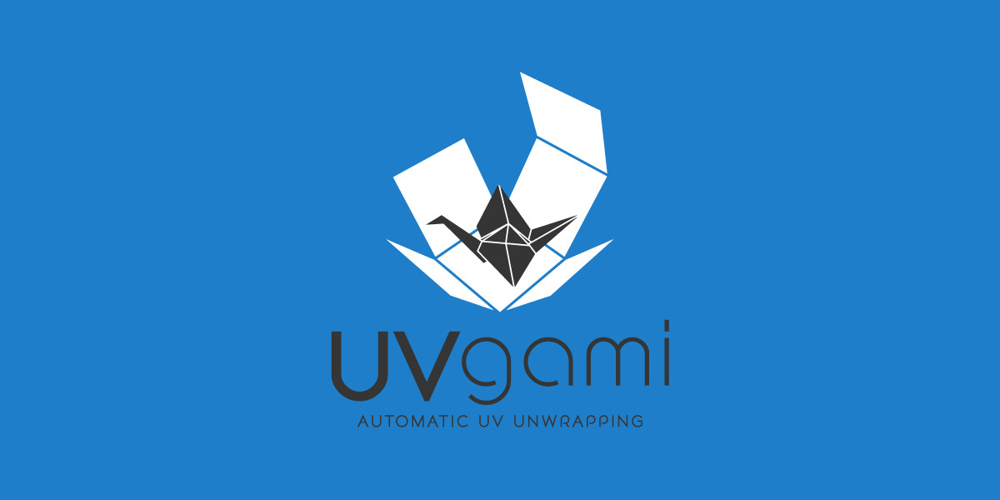
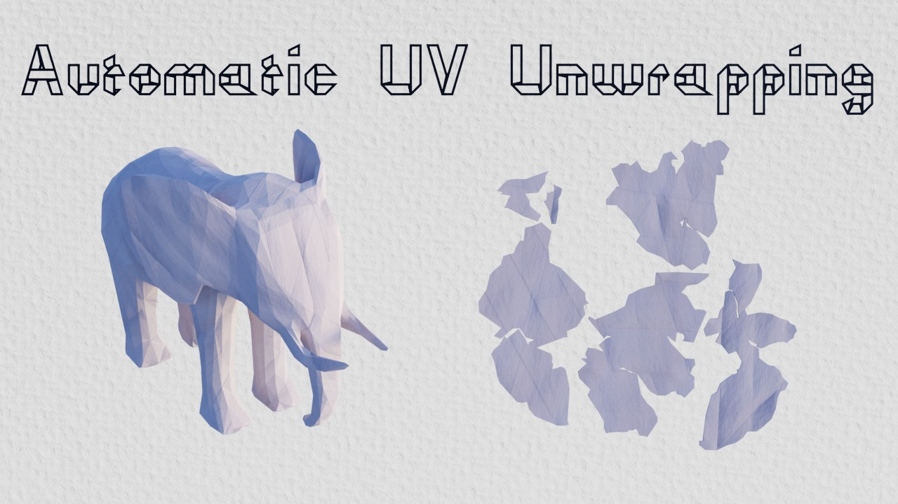
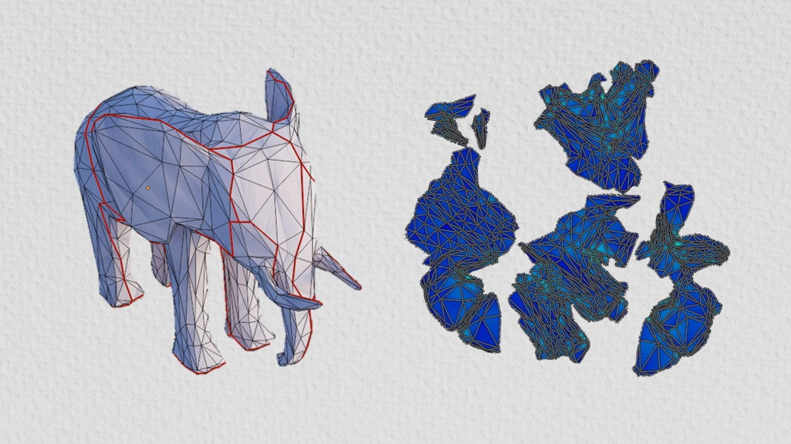
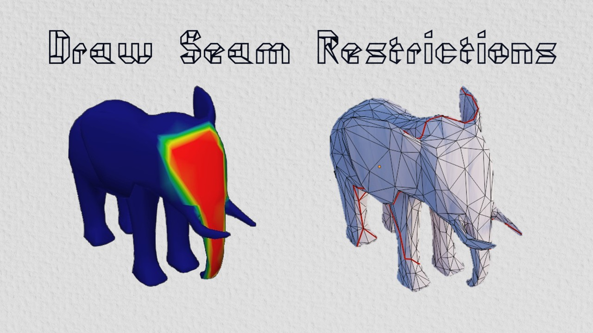
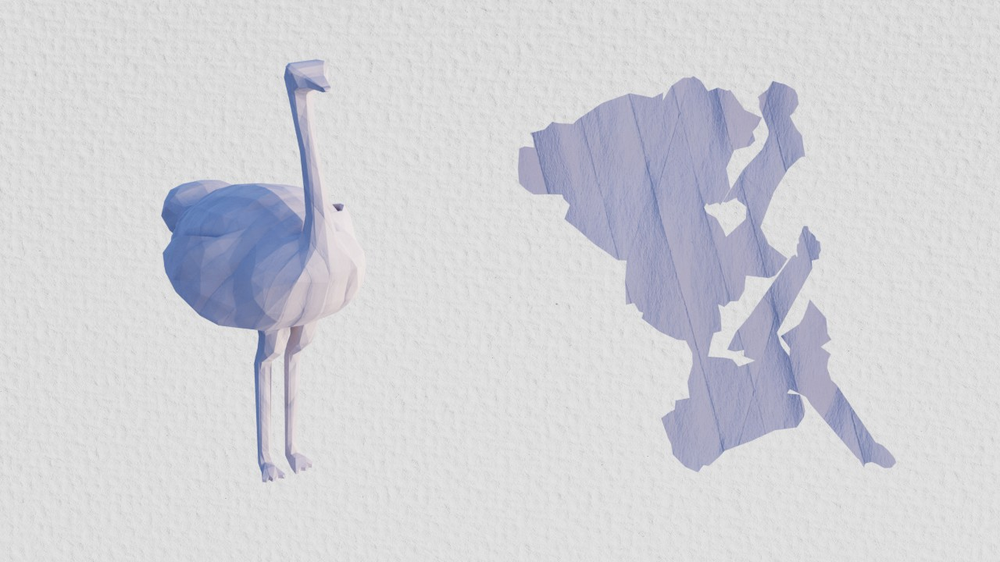
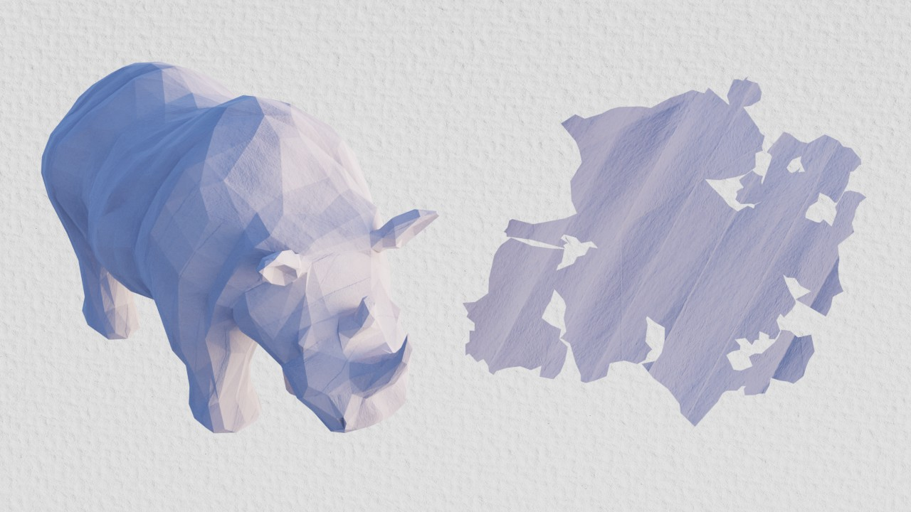

## Quickstart

> [!NOTE]
> Check the [user guide](/docs/docs.md) for more detailed documentation.

[Find the latest release here](https://github.com/danielboxer/UVgami/releases/latest).

There are [two](#engines) supported engines.

### Install the add-on

1. Get the add-on: `UVgami.zip`
2. The add-on will auto detect the engine since it's bundled

### Download PartUV engine after install

This is a different engine that requires an NVIDIA GPU. Install the add-on, then click `Install PartUV Engine` in the preferences.

Once installed, you can switch between engines in the n-panel.

## Engines

UVgami has two unwrapping engines, see the [docs](/docs/docs.md) for more info:

- OptCuts (CPU): [OptCuts](https://github.com/liminchen/OptCuts) by Minchen Li (MIT License), modified to work in Blender
- PartUV (AI, needs an NVIDIA GPU): [PartUV](https://github.com/EricWang12/PartUV) by Zhaoning Wang (Apache 2.0)
