# UVgami User Guide <!-- omit in toc -->

UVgami is a Blender add-on that allows you to automatically unwrap your meshes with a single button click.

There are three supported UV unwrapping engines. More info [here](#engines).

- OptCuts (CPU): [OptCuts](https://github.com/liminchen/OptCuts) by Minchen Li (MIT License), modified to work in Blender
- PartUV (GPU): [PartUV](https://github.com/EricWang12/PartUV) by Zhaoning Wang (Apache 2.0)
- xatlas (CPU): [xatlas](https://github.com/jpcy/xatlas) by Jonathan Young (MIT License)

Supported Operating Systems:

- Windows
- Linux
- Intel Mac
- Apple Silicon Mac

Blender 4.3+

## Table of Contents <!-- omit in toc -->

- [Installation](#installation)
- [Instructions](#instructions)
  - [Unwrap a Mesh](#unwrap-a-mesh)
  - [Unwrap Buttons](#unwrap-buttons)
    - [Stop](#stop)
    - [Cancel](#cancel)
    - [Cancel All](#cancel-all)
  - [Batch Unwrap](#batch-unwrap)
  - [Joined Objects](#joined-objects)
  - [Progress Bar](#progress-bar)
- [Settings](#settings)
  - [Symmetry](#symmetry)
  - [Speed](#speed)
    - [Concurrent mode](#concurrent-mode)
    - [Timeout](#timeout)
    - [Cuts](#cuts)
      - [Even](#even)
      - [Seams](#seams)
  - [Grid](#grid)
  - [Pack](#pack)
  - [Misc](#misc)
  - [Preferences](#preferences)
    - [Autosave (recommended)](#autosave-recommended)
    - [Show Popup](#show-popup)
    - [Progress Bar Option](#progress-bar-option)
    - [Not Unwrapped Collection](#not-unwrapped-collection)
    - [Reset Settings](#reset-settings)
- [Engines](#engines)
- [OptCuts](#optcuts)
  - [Engine Path](#engine-path)
  - [Quality](#quality)
  - [Import UVs](#import-uvs)
  - [Preserve Mesh](#preserve-mesh)
    - [Preserve Mesh: Full](#preserve-mesh-full)
    - [Preserve Mesh: Partial](#preserve-mesh-partial)
  - [Seam Restrictions](#seam-restrictions)
    - [Weight](#weight)
  - [Visual Mode](#visual-mode)
  - [Finish percentage](#finish-percentage)
  - [OptCuts Limitations](#optcuts-limitations)
    - [High Poly Meshes](#high-poly-meshes)
    - [Non Manifold Meshes](#non-manifold-meshes)
- [PartUV](#partuv)
  - [Segmentation mode](#segmentation-mode)
  - [Threshold](#threshold)
- [xatlas](#xatlas)
- [Limitations](#limitations)
  - [Triangulation](#triangulation)
  - [Invalid Objects](#invalid-objects)

## Installation

- Download `UVgami.zip` (don't extract it)
- Drag and drop the zip file into Blender
- The add-on will auto detect the OptCuts and xatlas engines since they are bundled.
- For the PartUV engine, you need to install it from the add-on [settings](#partuv)

## Instructions

### Unwrap a Mesh

- Press the `Unwrap` button

- If an unwrap is already active, you can still add new items to the queue

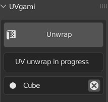

### Unwrap Buttons

#### Stop

Keep what's finished and stop the rest. If the mesh is made up of multiple pieces, the finished ones will be kept and the rest will be moved to a collection so you can see what wasn't unwrapped yet.

#### Cancel

Cancel the unwrap and discard the UV map.

#### Cancel All

Cancel all active unwraps at once. This button appears when there are multiple unwraps in the queue.

### Batch Unwrap

- Pressing unwrap with more than one object selected will add them all to the unwrap queue
- Most UVgami buttons will operate on all selected objects

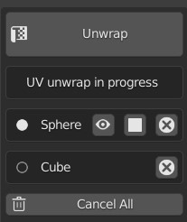

### Joined Objects

- If an object is made up of joined together objects, each piece of the object will be unwrapped separately and later joined together
- This will show up as a group in the ui

### Progress Bar

- The progress bar will appear in the bottom left corner of the 3D viewport
- For Optcuts, the colours correspond to the UV stretching in the current unwrap
  - Blue: Low stretching
  - Green: Medium stretching
  - Red: High stretching
- A progress bar with almost all blue doesn't necessarily mean that the unwrap will finish soon. Sometimes there is not much stretching, but the seams need adjustment to get the best result.
- For the other engines, the bar just represents the amount of meshes unwrapped

## Settings

### Symmetry

Use symmetry when you have a symmetrical mesh. The more axes selected, the faster the unwrap will be.

- Select multiple axes by holding `Shift`
- Deselect by holding `Shift`
- If `Merge` is turned on, the symmetrical UVs will overlap and merge. This is good if you want your texture mirrored. Turning `Merge` off will result in a seam down the set axes.
- Press preview to add a plane on the set axes. This is only for making sure you have selected the correct axes.

### Speed

#### Concurrent mode

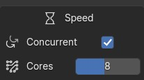

Unwrap multiple meshes simultaneously, making the unwrap much faster. This also has an effect on meshes that need to be separated. The amount of meshes able to be unwrapped at the same time depends on your computer.

You can choose the amount of cores to use below. For example, with 8 cores you can unwrap 8 meshes simultaneously.

#### Timeout

Set a maximum time in minutes for each unwrap. If an unwrap exceeds this time, the mesh will be moved to the "UVgami Not Unwrapped" collection. Set to `0` to disable the timeout. This is useful for when unwrapping multiple things at once so if one times out the rest will still unwrap.

#### Cuts

(should be used with concurrent mode on)

This splits the mesh apart, unwraps the pieces separately, then joins them together when finished. Doing this will make the unwrap much faster and is very useful for high poly meshes.

Sometimes there are errors when cuts is turned on. This is because bisecting the mesh can produce invalid geometry.

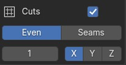

##### Even

Make even cuts along the XYZ axes of the mesh. The more cuts made, the faster the unwrap will be. Keep in mind there will be seams along the cuts so you wouldn't want to do too many.

Hold shift to select or deselect multiple axes.

##### Seams

This is for if you want more control over where the cuts will be. You can manually mark seams and the mesh will be cut there.

### Grid

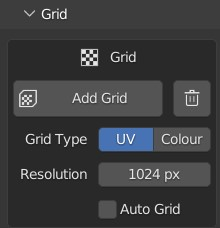

- Press `Add Grid` to apply a grid material to all selected objects. The shading mode will be changed to material preview.
- Press the button to the right of the `Add Grid` button to remove the grid material from selected objects. The shading mode will be changed to solid.
- Choose the grid type: `UV` for a standard UV grid, or `Colour` for a coloured UV grid.
- Set the `Resolution` to control the pixel size of the grid texture (default 1024).
- Turn `Auto Grid` on to automatically add a grid after unwrapping a mesh

### Pack

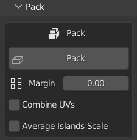

Packing uses the Blender packing engine. This is just to make packing a bit easier.

- Use the `Margin` slider to set the space between UV islands.
- Turn `Combine UVs` on if you want to combine UV maps of multiple objects into a single UV map.
- Turn `Average Islands Scale` on to scale all islands based on their actual space in 3D.
- Turn `Pack After Unwrap` on to automatically pack UVs after each unwrap finishes.

### Misc

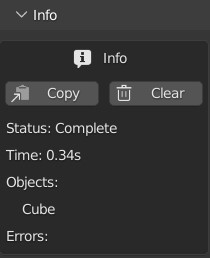

- Press `Preferences` to open the UVgami preferences dialog.

The info section below shows information about past unwraps. Any errors will also be shown here.

- Press `Copy` to copy all info to the clipboard
- Press `Clear` to clear all info

### Preferences

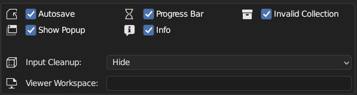

#### Autosave (recommended)

Save the Blender file before and after unwrapping to avoid losing work.

#### Show Popup

Show a popup when all meshes are finished unwrapping. This might contain other information like if any objects were invalid or if there were any errors.

#### Progress Bar Option

Show a [progress bar](#progress-bar) in the 3D view while unwrapping.

#### Not Unwrapped Collection

Add meshes that failed to unwrap, were cancelled, or were stopped to a collection.

#### Reset Settings

Reset all UVgami properties to their default values.

## Engines

Pick the engine at the top of the main panel.

| Engine              | Hardware   | Install                          | Notes                                                      |
| ------------------- | ---------- | -------------------------------- | ---------------------------------------------------------- |
| [OptCuts](#optcuts) | CPU        | bundled                          | Default CPU engine. Least stretching and islands, but slow |
| [PartUV](#partuv)   | GPU (CUDA) | settings, Windows and Linux only | GPU engine. Much faster than OptCuts on dense meshes       |
| [xatlas](#xatlas)   | CPU        | bundled                          | Fast CPU engine. Sometimes better than Smart UV Project      |

## OptCuts

### Engine Path

To use a different OptCuts build instead of the bundled one, select it with the button on the right of the `Engine Path` field. The `optcuts` app inside the engine folder is what should be selected. Builds are on the [OptCuts engine releases](https://github.com/DanielBoxer/UVgami/releases?q=optcuts%20engine) as `optcuts-engine-X.X.X-operating-system.zip`.

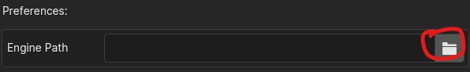

### Quality

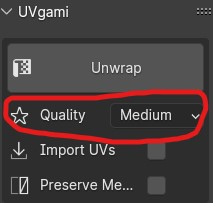

Increasing the unwrap quality will produce a UV map with less stretching. This also will make the unwrap take longer, so it's recommended to keep it at medium.

### Import UVs

Use the existing UV map on the input mesh as the starting point.

Some use cases:

- Deciding where you want some seams
- Finishing a manual unwrap
- Speeding up the unwrap time

### Preserve Mesh

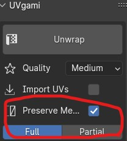

- Turn this on to keep the final mesh the same as the original mesh. This is useful when you are working with quads and don't want the final mesh to be triangulated.
- If the mesh had any n-gons, the final result might still have some triangles. There might also be a small amount of extra stretching and overlap. The overlap is easily fixed by hand and can be found by using the Blender `Select Overlap` UV operator.

#### Preserve Mesh: Full

- The final mesh will be fully untriangulated and the seams will be rerouted.
- This might cause some overlap in the UV map, but this can be easily fixed manually

#### Preserve Mesh: Partial

- All areas of the mesh except for the seams will be untriangulated

### Seam Restrictions

#### Draw on areas of the mesh you don't want seams added <!-- omit in toc -->

- Press `Draw` to start drawing on the mesh
- Red areas will be avoided and will have no seams

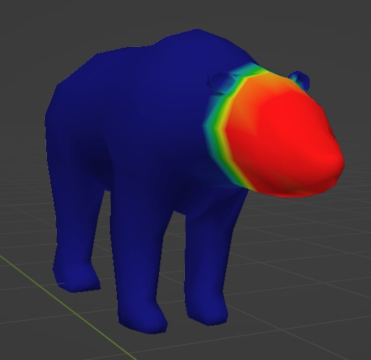

##### Attribution for 3D models: <!-- omit in toc -->

###### "25 Animals Pack" (<https://skfb.ly/orQpx>) by MadTrollStudio is licensed under Creative Commons Attribution (<http://creativecommons.org/licenses/by/4.0/>) <!-- omit in toc -->

Before seam restrictions:

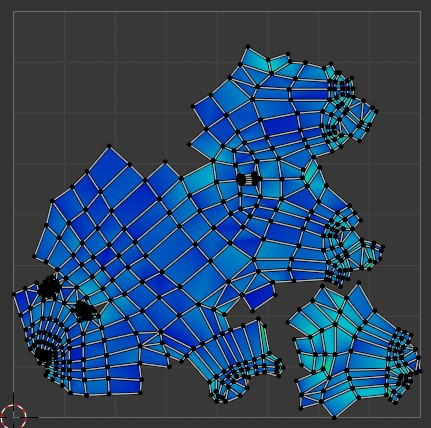

After seam restrictions:

#### Weight

Use the `Weight` slider to control how strictly the seam restrictions are followed. A higher weight will avoid the restricted areas more, but will take longer to finish the unwrap.

### Visual Mode

Press to enter visual mode. This will show a real time view of the unwrap as it progresses. All keyboard and mouse input will be blocked. Press `ESC` to exit visual mode.

### Finish percentage

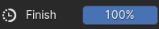

Stop the unwrap early based on the amount of stretching.

### OptCuts Limitations

#### High Poly Meshes

Unwrapping high/medium poly meshes is very slow

Current ways to speed up the unwrap:

- Use the PartUV or xatlas engine instead
- Turn `Concurrent` mode on and increase the max cores
- Turn `Symmetry` on if the mesh is symmetrical
- Don't add too many seam restrictions
- Use the cuts option
- Consider lowering the quality or setting the finish percent lower. Though this isn't recommended as the final unwrap will probably have too much stretching.

#### Non Manifold Meshes

OptCuts can't unwrap some non manifold meshes. For example, the Suzanne monkey head is invalid because it's non manifold. Unwrapping it will have this result, where the eyes are unwrapped succesfully, and the head was not:

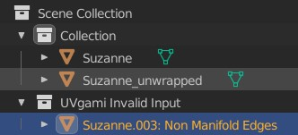

In this case, the problem is this area, which when fixed, will unwrap properly:

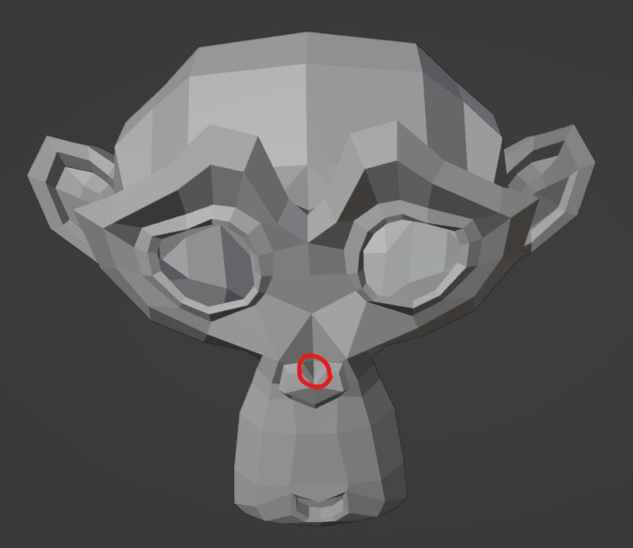
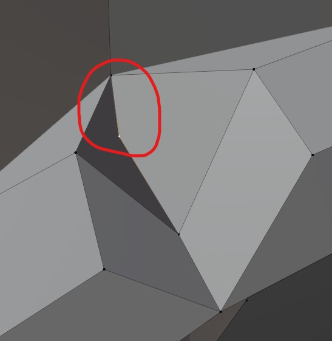

## PartUV

PartUV needs CUDA and runs on Windows or Linux. Install the add-on first, then in UVgami preferences click install. See below for the two segmentation install options:

### Segmentation mode

- AI (5 gb): Uses PartField which is an AI model to do the segmentation which has the best results. This results in less seams.
- Geometric (200 mb): Finds seams from the mesh surface shape. Fast and decent results.

### Threshold

A lower threshold produces more UV islands.

## xatlas

xatlas is bundled and auto detected like OptCuts. It's very fast but will result in more islands/seams than Optcuts and PartUV. Though it can still have better results than Blender smart UV project.

## Limitations

### Triangulation

- The mesh currently needs to be triangulated in order to unwrap it (the add-on will do this automatically)

### Invalid Objects

- The unwrapper can't unwrap some objects for various reasons
- If it can't unwrap an object, you will be notified, or if the object is part of a separated object, it will be moved to a "UVgami Not Unwrapped" collection
